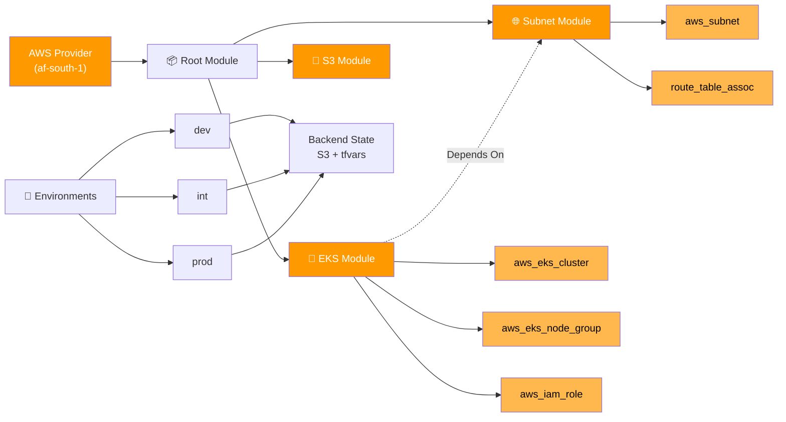

# 🚀 Capitec Terraform Project

[](https://www.terraform.io/)
[](https://aws.amazon.com/)
[](https://aws.amazon.com/about-aws/global-infrastructure/regional-product-services/)
[](modules/)
[](values/)
[](.)

**Status:**   

## 📋 Overview

A modular Terraform configuration for provisioning AWS infrastructure including **EKS clusters**, **S3 storage**, and **VPC networking** across multiple environments (dev, int, prod).

---

## 🏗️ Architecture



---

## 📁 Project Structure

| File/Directory | Purpose |
|---|---|
| `main.tf` | 📌 Root module orchestration (calls subnet → EKS modules) |
| `providers.tf` | ☁️ AWS provider & S3 backend config |
| `variables.tf` | 🔑 Root-level input variables |
| `outputs.tf` | 📤 Root-level outputs |
| `locals.tf` | 🏷️ Local values (if needed) |
| `modules/subnet/` | 🌐 Subnet module (VPC networking) |
| `modules/eks/` | 🐙 EKS module (Kubernetes cluster) |
| `modules/s3/` | 💾 S3 module (object storage) |
| `values/{env}/` | 🔑 Environment-specific tfvars & backend configs |
| `.github/workflows/` | 🔄 CI/CD pipeline (plan → approve → apply) |

---

## 🔄 Module Orchestration (main.tf)

```terraform
# 1. Create subnet infrastructure first
module "kayla-subnet" {
  source      = "./modules/subnet"
  environment = var.environment
  lookup_key  = "kayla_lee_jansma"
  # ... other variables
}

# 2. Create EKS cluster using subnets
module "kayla-eks" {
  source     = "./modules/eks"
  subnet_ids = module.kayla-subnet.subnet_ids  # ← Dependency
  environment = var.environment
  # ... other variables
  
  depends_on = [module.kayla-subnet]
}
```

**Flow:**
```
terraform apply
  ├─ Subnet module runs first
  │  └─ Creates subnets, route tables
  │
  └─ EKS module runs after
     └─ Receives subnet_ids
     └─ Creates cluster & nodes
```

---

## 🚀 Quick Start

### Prerequisites
```bash
terraform >= 1.15
aws-cli configured
kubectl (for EKS access)
```

### Initialize & Deploy

<details>
<summary><strong>💻 Dev Environment</strong></summary>

```bash
# Initialize with dev backend
terraform init -backend-config="./values/dev/dev.tfbackend"

# Plan changes
terraform plan -var-file="./values/dev/dev.tfvars"

# Apply configuration
terraform apply -var-file="./values/dev/dev.tfvars"
```

</details>

<details>
<summary><strong>💻 Int Environment</strong></summary>

```bash
terraform init -backend-config="./values/int/int.tfbackend"
terraform plan -var-file="./values/int/int.tfvars"
terraform apply -var-file="./values/int/int.tfvars"
```

</details>

<details>
<summary><strong>💻 Prod Environment</strong></summary>

```bash
terraform init -backend-config="./values/prod/prod.tfbackend"
terraform plan -var-file="./values/prod/prod.tfvars"
terraform apply -var-file="./values/prod/prod.tfvars"
```

</details>

---

## ⚙️ Configuration

### Key Variables

| Variable | Type | Default | Purpose |
|----------|------|---------|---------|
| `initials` | string | `kl` | User initials for resource naming |
| `surname` | string | `jansma` | Surname for naming convention |
| `environment` | string | — | Deployment environment (dev/int/prod) |
| `capacity_type` | string | `SPOT` | EC2 capacity (ON_DEMAND or SPOT) |

### Naming Convention
```
{surname}{initials}-{resource}-{environment}
Example: jansmakl-eks-dev
```

### AWS Region
```
af-south-1 (Africa - Cape Town)
```

---

## 📊 Module Details

### 🌐 Subnet Module
**Location:** `modules/subnet/`

Manages **all VPC networking infrastructure**:
- Creates subnets across multiple availability zones (af-south-1a, af-south-1b, af-south-1c)
- Configures route table associations
- Maintains subnet allocation mapping for all training participants
- Handles default tags and naming conventions
- **Outputs:** `subnet_ids`, `subnet_map`, `default_tags`

**Variables:**
```terraform
availability_zones  # List of AZs
vpc_id             # VPC to use
rt_id              # Route table ID
lookup_key         # Name mapping (e.g., "kayla_lee_jansma")
```

### 🐙 EKS Module
**Location:** `modules/eks/`

Creates **Kubernetes infrastructure only**:
- EKS cluster with API-only authentication mode
- EKS node groups with auto-scaling
- IAM roles and policies (cluster + node roles)
- Security group rules for NodePort services
- EKS access entries for cluster management
- **Depends On:** Subnet module (receives `subnet_ids` as input)

**Variables:**
```terraform
subnet_ids        # From subnet module output
capacity_type     # ON_DEMAND or SPOT
instance_types    # Node instance types
node_min/max/desired_size  # Auto-scaling config
```

### 💾 S3 Module
**Location:** `modules/s3/`

S3 bucket configuration for object storage (add-on ready)

### 🔗 Module Dependencies
```
Subnet Module
    ↓ (outputs subnet_ids)
    ↓
EKS Module
    ↓
Node Groups + Cluster use subnets
```

This separation allows:
- ✅ Reusing subnets for other resources (RDS, Lambda, etc.)
- ✅ Independent updates to networking vs compute
- ✅ Better testability and maintainability
- ✅ Clear ownership of resources

---

## 🔐 State Management

Backend uses **S3 with remote state**:
```bash
# Naming: {surname}{initials}-s3-backend
# Example: jansmakl-s3-backend
```

Each environment maintains isolated state:
- `values/dev/dev.tfbackend`
- `values/int/int.tfbackend`
- `values/prod/prod.tfbackend`

---

## 🎯 Common Commands

```bash
# Format code
terraform fmt -recursive

# Validate configuration
terraform validate

# Show current state
terraform show

# Destroy resources
terraform destroy -var-file="./values/{env}/{env}.tfvars"

# Get EKS credentials
aws eks update-kubeconfig --name {cluster-name} --region af-south-1
```

---

## ✅ Environments Status

| Environment | Status | Purpose |
|:---|:---:|---|
| **dev** | 🟢 Development | Feature testing & experimentation |
| **int** | 🟡 Integration | Pre-production validation |
| **prod** | 🔴 Production | Live infrastructure |

---

## 📝 Notes

- All resources tagged with `default_tags` from `locals.tf`
- EKS module supports multiple availability zones
- Capacity type validation prevents invalid configurations
- State files must never be committed to version control

---

<div align="center">

**Disclaimer:** This Terraform code has never `destroy`ed anything... permanently. 🚀

Made with ☕ and occasional `terraform apply` panic.

</div>
