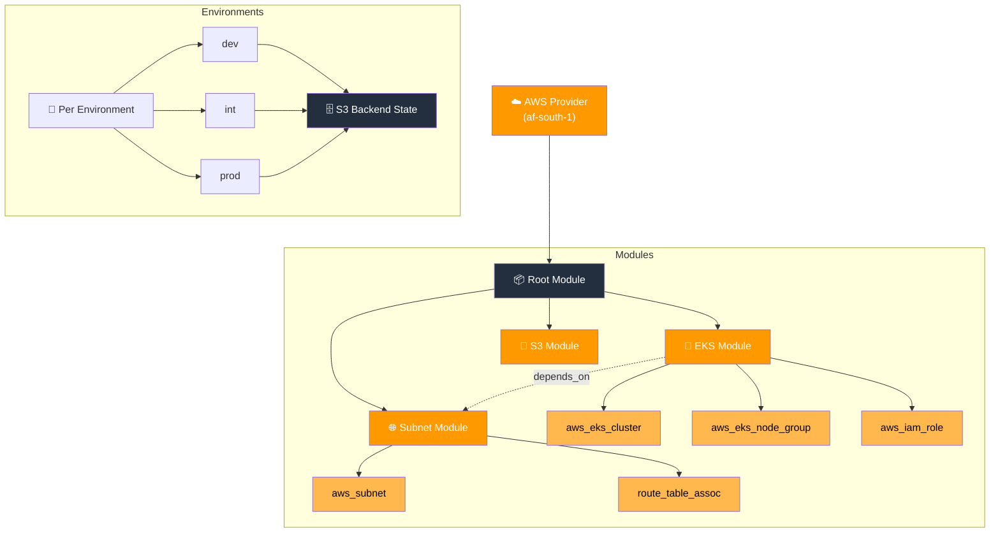

# 🚀 Capitec Terraform Project

[\](https://www.terraform.io/)
[\](https://aws.amazon.com/)
[\](https://aws.amazon.com/about-aws/global-infrastructure/regional-product-services/)

Modular Terraform for provisioning EKS, S3, and VPC networking across dev, int, and prod on AWS `af-south-1`.

---

## 🏗️ Architecture



---

## 🚀 Usage

```bash
# Init (swap env as needed: dev, int, prod)
terraform init -backend-config="./values/dev/dev.tfbackend" -reconfigure

# Plan
terraform plan -var-file="./values/dev/dev.tfvars"

# Apply
terraform apply -var-file="./values/dev/dev.tfvars"

# Destroy
terraform destroy -var-file="./values/dev/dev.tfvars"

# EKS access
aws eks update-kubeconfig --region af-south-1 --name jansmakl-eks-dev
```

---

## 🔄 CI/CD

| Trigger | Action |
|---------|--------|
| Push to `dev` | Auto-apply dev |
| PR to `int`/`prod` | Plan target env, post diff to PR |
| Merge to `int`/`prod` | Auto-apply (with approval gate) |
| Workflow dispatch | Manual plan/apply/destroy |

---

## ⚙️ Key Variables

| Variable | Default | Purpose |
|----------|---------|---------|
| `environment` | — | dev / int / prod |
| `capacity_type` | `ON_DEMAND` | ON_DEMAND or SPOT |
| `initials` | `kl` | Used in resource naming |
| `surname` | `jansma` | Used in resource naming |

Naming convention: `jansmakl-eks-dev`

---

<div align="center">

**Disclaimer:** This Terraform code has never `destroy`ed anything... permanently. 🚀

Made with ☕ and occasional `terraform apply` panic.

</div>
