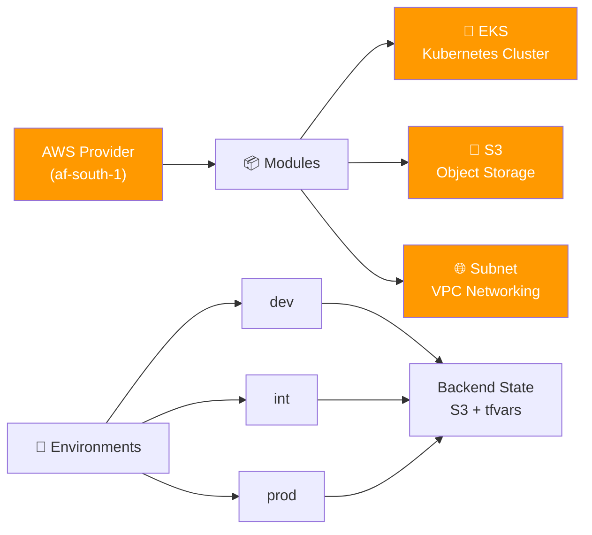

# 🚀 Capitec Terraform Project

[](https://www.terraform.io/)
[](https://aws.amazon.com/)
[](https://aws.amazon.com/about-aws/global-infrastructure/regional-product-services/)
[](LICENSE)
[](modules/)
[](values/)
[](.)

**Status:**   

## 📋 Overview

A modular Terraform configuration for provisioning AWS infrastructure including **EKS clusters**, **S3 storage**, and **VPC networking** across multiple environments (dev, int, prod).

---

## 🏗️ Architecture



---

## 📁 Project Structure

| Directory | Purpose |
|-----------|---------|
| `modules/eks/` | 🐙 EKS cluster configuration with auto-scaling groups |
| `modules/s3/` | 💾 S3 bucket definitions |
| `modules/subnet/` | 🌐 VPC subnet and routing setup |
| `values/{env}/` | 🔑 Environment-specific variables & backend configs |
| `locals.tf` | 📌 Local variables and tags |
| `providers.tf` | ☁️ AWS provider configuration |

---

## 🚀 Quick Start

### Prerequisites
```bash
terraform >= 1.15
aws-cli configured
kubectl (for EKS access)
```

### Initialize & Deploy

<details>
<summary><strong>💻 Dev Environment</strong></summary>

```bash
# Initialize with dev backend
terraform init -backend-config="./values/dev/dev.tfbackend"

# Plan changes
terraform plan -var-file="./values/dev/dev.tfvars"

# Apply configuration
terraform apply -var-file="./values/dev/dev.tfvars"
```

</details>

<details>
<summary><strong>💻 Int Environment</strong></summary>

```bash
terraform init -backend-config="./values/int/int.tfbackend"
terraform plan -var-file="./values/int/int.tfvars"
terraform apply -var-file="./values/int/int.tfvars"
```

</details>

<details>
<summary><strong>💻 Prod Environment</strong></summary>

```bash
terraform init -backend-config="./values/prod/prod.tfbackend"
terraform plan -var-file="./values/prod/prod.tfvars"
terraform apply -var-file="./values/prod/prod.tfvars"
```

</details>

---

## ⚙️ Configuration

### Key Variables

| Variable | Type | Default | Purpose |
|----------|------|---------|---------|
| `initials` | string | `kl` | User initials for resource naming |
| `surname` | string | `jansma` | Surname for naming convention |
| `environment` | string | — | Deployment environment (dev/int/prod) |
| `capacity_type` | string | `SPOT` | EC2 capacity (ON_DEMAND or SPOT) |

### Naming Convention
```
{surname}{initials}-{resource}-{environment}
Example: jansma-kl-eks-dev
```

### AWS Region
```
af-south-1 (Africa - Cape Town)
```

---

## 📊 Module Details

### 🐙 EKS Module
Creates an EKS Kubernetes cluster with:
- Multi-AZ subnet deployment
- Auto-scaling node groups
- Route table associations
- SPOT/ON_DEMAND capacity options

### 💾 S3 Module
S3 bucket configuration for object storage (add-on ready)

### 🌐 Subnet Module
VPC networking with:
- Multiple availability zones
- Public subnet configuration
- Route table management

---

## 🔐 State Management

Backend uses **S3 with remote state**:
```bash
# Naming: {surname}{initials}-s3-backend
# Example: jansmakers3-backend
```

Each environment maintains isolated state:
- `values/dev/dev.tfbackend`
- `values/int/int.tfbackend`
- `values/prod/prod.tfbackend`

---

## 🎯 Common Commands

```bash
# Format code
terraform fmt -recursive

# Validate configuration
terraform validate

# Show current state
terraform show

# Destroy resources
terraform destroy -var-file="./values/{env}/{env}.tfvars"

# Get EKS credentials
aws eks update-kubeconfig --name {cluster-name} --region af-south-1
```

---

## ✅ Environments Status

| Environment | Status | Purpose |
|:---|:---:|---|
| **dev** | 🟢 Development | Feature testing & experimentation |
| **int** | 🟡 Integration | Pre-production validation |
| **prod** | 🔴 Production | Live infrastructure |

---

## 📝 Notes

- All resources tagged with `default_tags` from `locals.tf`
- EKS module supports multiple availability zones
- Capacity type validation prevents invalid configurations
- State files must never be committed to version control

---

## 🤝 Support

For issues or questions, check:
- Terraform logs: `terraform debug`
- AWS Console: https://console.aws.amazon.com
- Kubectl access: `kubectl cluster-info`

---

<div align="center">

**Built with ❤️ for Capitec Infrastructure**

</div>
